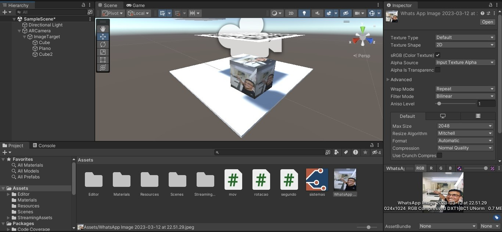
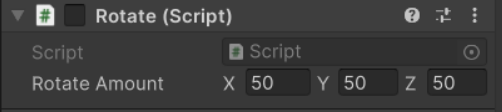

# TrabalhoUnity

## Unity_Repositorio


<h1>Aula de Computação Gráfica e Tecnologias Imersivas - Vulforia x Unity</h1>

 >Instalação do Vulforia

Unity e Vuforia oferecem uma soluções incriveis para o desenvolvimento de aplicativos de Realidade Aumentada (AR), permitindo que desenvolvedores criem experiências incríveis de AR para diversas aplicações.

<p align="center">

</p>

[Baixar o Vuforia](https://developer.vuforia.com/user/login?url=/downloads/sdk%3F_%3D1678117884)
----------------------

É necessário criar uma conta e obter uma licença para registrar seu alvo (Target) no Vuforia.
#### Além disso, você precisará copiar a chave de licença para garantir o funcionamento adequado.

Feito isso, já pode fazer o Download do banco de dados (target+features).  

<p align="center">

</p>

####  TARGET

<p align="center">

</p>

#### Primeiros Passos:


    ° No Unity faça a criação do AR camera e do imagem Target importando seu banco de dados;

    ° Depois faça a inclusão da sua chave copiada do vulforia;

    ° Para realizar a rotação pode incluir um cubo ou outro objeto da sua escolha;

    ° Também pode ser inserida uma imagem no seu objeto que será rotacionado.


A imagem a seguir apresenta a ordem que os objetos devem ficar: 

1: ArCamera

2: ImageTarget

3: Cube (ou o objeto que você escolher)

<p align="center">

</p>

> ### Rotacionar o objeto
 
Nesta etapa, foi adicionada uma rotação automática ao objeto. Portanto, quando o código QR for exibido na tela, o objeto começará a girar.

#### Script para a rotação do objeto:
```javascript
usando System.Collections;
usando System.Collections.Generic;
usando UnityEngine;

rotação de classe pública: MonoBehaviour
{
    public Vector3 rotateAmount;
    void Início()
    {
        
    }

    void Atualizar()
    {
        transform.Rotate(rotateAmount * Time.deltaTime);
    }
}
```
> Para adicionar o script, basta clicar com o botão direito do mouse em "Assets", selecionar "Create" e depois "C# Script". Em seguida, mova o script para dentro do objeto criado.

. 

 Também precisamos incluir o eixo de rotação do seu objeto:

 <p align="center">

</p>

O resultado será a rotação automática do seu objeto. 

> ### Movimentar o objeto

No mesmo objeto criado, agora você pode adicionar movimento. Você pode atribuir teclas para mover seu cubo no formato que desejar.


#### O script para movimentar o cubo:

```javascript
using System.Collections;
using System.Collections.Generic;
using UnityEngine;

public class movimento : MonoBehaviour
{
    // Start is called before the first frame update
    void Start()
    {
        
    }

    // Update is called once per frame
    void Update()
    {
        if (Input.GetKey(KeyCode.LeftArrow))
        {
            transform.Translate(0.01f, 0f, 0f);
        }
        if (Input.GetKey(KeyCode.RightArrow))
        {
            transform.Translate(-0.01f, 0f, 0f);
        }
        if (Input.GetKey(KeyCode.DownArrow))
        {
            transform.Translate(0f, 0f, 0.01f);
        }
        if (Input.GetKey(KeyCode.UpArrow))
        {
            transform.Translate(0f, 0f, -0.01f);
        }
    }
}
```

Após executar o script, você poderá mover o objeto para os lados, para cima e para baixo utilizando as setas do teclado.


> ### Movimentando um segundo objeto

Neste processo, será adicionado um segundo objeto que também poderá ser movimentado. Para isso, você pode criar um novo objeto ou duplicar o objeto já existente.

```javascript
    using System.Collections;
using System.Collections.Generic;
using UnityEngine;

public class movi : MonoBehaviour
{
    // Start is called before the first frame update
    void Start()
    {
        
    }

    // Update is called once per frame
    void Update()
    {
        if (Input.GetKey(KeyCode.A))
        {
            transform.Translate(0.01f, 0f, 0f);
        }
        if (Input.GetKey(KeyCode.D))
        {
            transform.Translate(-0.01f, 0f, 0f);
        }
        if (Input.GetKey(KeyCode.S))
        {
            transform.Translate(0f, 0f, 0.01f);
        }
        if (Input.GetKey(KeyCode.W))
        {
            transform.Translate(0f, 0f, -0.01f);
        }
    }
}
```

 Após a execução do script, o segundo objeto também poderá ser movido usando as teclas "A, D, S, W". Agora, ambos os objetos podem ser movidos separadamente.


>Valeu!
